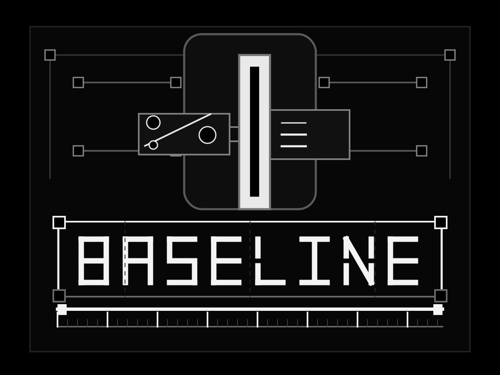

# baseline

<p align="center">
  
</p>

<p align="center">
  <a href="resources/logo.ans">ANSI logo</a> |
  <a href="resources/logo.txt">plain text logo</a>
</p>

A drift-correction system for [Claude Code](https://claude.com/claude-code). Over a long session the agent forgets standing rules (e.g. "route file operations through subagents, don't do them inline"). This installs a hook that periodically forces the agent to recite a small baseline of standing rules before continuing. Reciting both re-aligns the agent (generating the rule primes the next action) and exposes drift (you see in the recital whether it got the rules right).

Inspired by the Blade Runner 2049 baseline test.

## What it is

Claude Code sessions can run for hundreds of turns across hours of work. As context fills, the agent drifts from instructions you gave it — especially behavioral rules like "delegate file operations to subagents" or "always update the task tracker after changes." This package installs a `UserPromptSubmit` hook that, every Nth user prompt, injects a baseline recital: the agent must open its reply with a fixed prefix line and restate each rule verbatim before continuing.

The recital keeps the agent aligned. The rules are pithy, one per line, and live in a single editable file. You tune them, the interval, and the prefix line in that file; changes apply on the next prompt with no reinstall. Because this file is injected into future model context, treat it as trusted configuration.

This package targets Claude Code. The engine is designed so adapters for other agent harnesses could be added later, but none ship today.

## How it works

A small hook program runs on every prompt submit. It reads `session_id` from the JSON the harness passes on stdin, keeps a per-session turn counter in `~/.claude/.baseline-counters.json`, and on every Nth turn prints a JSON object whose `additionalContext` field Claude Code injects into the model's context as a system reminder. The agent sees the recital text and is prompted to open its reply with the prefix line followed by the rules.

All tunable parameters (the rules, interval, and prefix) live in the central
`~/.omne/baseline.md` file. Each agent config links its local `baseline.md` to
that central file. With a symlink or hardlink, the hook reads central edits live
on every fire; with a plain-copy fallback, rerun `install` or `update` after
editing.

## Requirements

- **Claude Code** — the CLI agent harness
- **Node.js** — used by the installer/manager and the default hook runtime
- **Zig 0.16.x** (optional) — only if you want to compile the native hook yourself

**Platforms:** The default JS runtime works anywhere Claude Code and Node.js work. Prebuilt native binaries ship for Windows x64 and Linux x64 only.

## Install

Run the installer for your platform:

**Windows (PowerShell):**
```powershell
.\install.ps1
```

**Linux / macOS (bash):**
```bash
bash install.sh
```

Both scripts delegate to `node scripts/manage.js install`, which:
1. Deploys the canonical hook + the single editable `baseline.md` to a **central
   store**, `~/.omne` (JS runtime by default)
2. **Links** each agent's config dir back into the center —
   `~/.claude/hooks/baseline-recital.js` → `~/.omne/hooks/baseline-recital.js`
   and `~/.claude/baseline.md` → `~/.omne/baseline.md`
3. Wires the hook into `~/.claude/settings.json` under `UserPromptSubmit`

When `status` reports a symlink or hardlink, editing the central
`~/.omne/baseline.md` changes the live rules for wired agents at once. If the
link layer had to fall back to a plain copy, rerun `install` or `update` after
editing the central file.

The central root is `~/.omne` by default; override it with the `OMNE_HOME`
environment variable. On Windows without symlink privilege the link layer
degrades automatically to a hardlink (then a plain copy as a last resort);
`status`/`doctor` report which mechanism is in effect.

After install, open `/hooks` in Claude Code once (or restart Claude Code) so the settings reload.

## Runtime options

The hook runs as the canonical Node.js script by default. Native runtimes are explicit because they execute on every prompt.

### Default: JavaScript

```bash
node scripts/manage.js install
```

This deploys and wires `scripts/baseline-recital.js`, the source of truth.

### Optional: prebuilt binaries

The repo ships checked prebuilt native hooks:
- `bin/baseline-recital-windows-x64.exe` (Windows)
- `bin/baseline-recital-linux-x64` (Linux)
- `bin/SHA256SUMS` (verified before install)

No Zig compiler required. macOS has no shipped prebuilt.

To explicitly request the prebuilt binary:
```bash
bash install.sh --runtime prebuilt
```

### Optional: compile from source

If you have Zig 0.16.x installed, you can compile the hook from source.

**Compile for your host platform:**
```bash
# Linux/macOS
bash install.sh --build

# Windows (PowerShell)
.\install.ps1 -build
```

This compiles `scripts/baseline-recital.zig` for your host and deploys it to the
central `~/.omne/hooks/` store, then links the agent hook path to it.

**Regenerate both committed prebuilts via cross-compilation:**
```bash
# Linux/macOS
bash build.sh

# Windows (PowerShell)
.\build.ps1
```

This regenerates `bin/baseline-recital-windows-x64.exe`, `bin/baseline-recital-linux-x64`, and `bin/SHA256SUMS` from the native port.

To explicitly request the JS runtime:
```bash
bash install.sh --runtime js
```

## Editing the baseline (the everyday task)

Edit `~/.omne/baseline.md`. This is the file you'll touch most often. The agent
path `~/.claude/baseline.md` links back to it after install.

**Example:**
```markdown
---
interval: 5
prefix: BASELINE ALIGNED:
---
# Comments and blank lines are ignored. One rule per line below.
File read/write/search -> subagent (cavecrew-investigator/builder, Explore), not inline. Save main ctx.
Update task tracker (arca/scheduler) after changes. Frontmatter time-modified required.
Never commit without explicit user request.
```

**Fields:**
- `interval:` — Fire every Nth prompt (integer). Lower = tighter leash, more tokens.
- `prefix:` — The literal line the agent opens its reply with when reciting.
- **Body** — One rule per line. Keep rules short (they're injected into context every fire). Lines starting with `#` and blank lines are ignored.

**Changes apply on the next prompt** when `status` reports a symlink or hardlink.
If it reports a plain-copy fallback, rerun `install` or `update`.

After editing, confirm what's live with:
```bash
node scripts/manage.js status
```

## Managing the hook

The manager script provides these commands:

| Command | Description |
|---------|-------------|
| `status` | Shows what's installed, whether it's in sync with the canonical source, and the current rules. |
| `verify` | Functional test: confirms the hook fires on turn N as expected. |
| `install` | Deploys the hook + `baseline.md` to the central `~/.omne`, links each agent dir to it, and wires `settings.json`. Idempotent. Migrates a pre-existing real `baseline.md` into the center without clobbering edits. |
| `update` | Redeploys the central hook and re-wires settings + re-links from the current repo source, keeping the runtime already in use (native falls back to JS if unavailable). |
| `doctor` | Scans the installation and reports each check as OK/WARN/FAIL — including whether each agent link resolves to the center. `--fix` repairs the auto-fixable issues and re-scans. |
| `uninstall` | Unwires the hook from settings and removes the per-agent links. Preserves the central `~/.omne/baseline.md`. |

**Run with Node.js:**
```bash
node scripts/manage.js status
node scripts/manage.js install
node scripts/manage.js verify
node scripts/manage.js update
node scripts/manage.js doctor          # add --fix to repair
node scripts/manage.js uninstall
```

**Or via the platform wrapper scripts** (Windows `.ps1`, Linux/macOS `.sh`):
```bash
bash update.sh        # pulls latest if a git checkout, then redeploys
bash doctor.sh --fix  # scan + repair
bash uninstall.sh
```
```powershell
.\update.ps1
.\doctor.ps1 -fix
.\uninstall.ps1
```

All commands are idempotent and preserve any co-resident `UserPromptSubmit` hooks (e.g. other skills). Settings edits are surgical. `install` and `uninstall` refuse to rewrite malformed `settings.json`; fix the JSON first so existing hooks are not lost.

## Repository layout

```
baseline/
├── install.sh / install.ps1     # Installer (bash / PowerShell)
├── update.sh / update.ps1       # Pull latest + redeploy hook (bash / PowerShell)
├── doctor.sh / doctor.ps1       # Scan + repair installation; --fix / -fix (bash / PowerShell)
├── uninstall.sh / uninstall.ps1 # Remove hook, keep baseline.md (bash / PowerShell)
├── build.sh                 # Cross-compile both prebuilts (bash)
├── build.ps1                # Cross-compile both prebuilts (PowerShell)
├── scripts/
│   ├── manage.js            # Manager: install, update, doctor, status, verify, uninstall
│   ├── baseline-recital.js  # Hook source (canonical, default)
│   ├── baseline-recital.zig # Optional native port; mirrors JS behavior
│   └── test.js              # Isolated manager/hook regression tests
├── bin/
│   ├── baseline-recital-windows-x64.exe
│   ├── baseline-recital-linux-x64
│   └── SHA256SUMS
├── assets/
│   └── baseline.template.md # Seeded as ~/.omne/baseline.md if missing
├── resources/
│   ├── logo.png             # Repository image / preview source
│   ├── logo.svg             # Scalable logo source
│   ├── logo.txt             # Plain text ASM logo
│   └── logo.ans             # ANSI ASM logo
├── references/
│   └── architecture.md      # Internals: counting, injection, hardening
├── SKILL.md                 # Skill manifest for Claude Code
└── README.md                # This file
```

## Uninstall

```bash
node scripts/manage.js uninstall
```

This unwires the hook from `~/.claude/settings.json` and removes the per-agent links from `~/.claude/hooks/` and `~/.claude/baseline.md`. The central `~/.omne/baseline.md` is preserved (delete `~/.omne` by hand if you want it gone).

## How firing is counted

The hook fires on turns N, 2N, 3N, … where N is the interval. Specifically, it fires when `turn_count % interval == 0`. When N > 1 the first fire is on turn N (turn 1 is silent); when N is 1 every turn fires. Counters are auto-pruned after 7 days of inactivity.

The hook always exits with code 0, even on internal errors, so it never blocks prompt submission. Hot-path reads are bounded: stdin and counters are capped at 1 MiB, `baseline.md` at 64 KiB, and injected rules at 50 lines of 500 characters each.

## Test

```bash
node scripts/test.js
```

The tests use temporary `CLAUDE_CONFIG_DIR` directories and do not touch your real Claude settings.

## License

MIT
